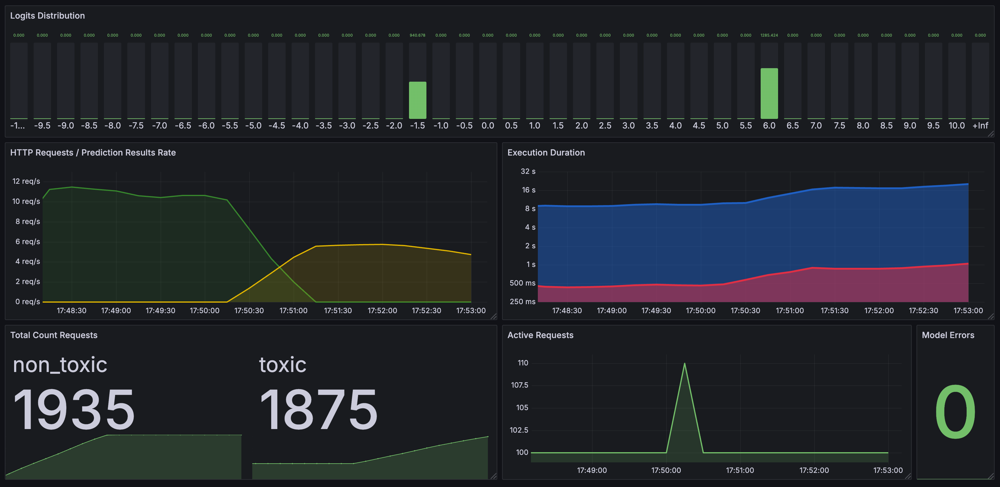

# Toxicity detector
A simple HTTP server for checking text toxicity (specifically for banned words).

# Model
This project uses the [one-for-all-toxicity-v3](https://huggingface.co/FredZhang7/one-for-all-toxicity-v3) model, which is distributed under the [CC-BY-4.0 license](https://choosealicense.com/licenses/cc-by-4.0).
The model supports multilingualism (55 languages). It was trained on the [toxi-text-3M dataset](https://huggingface.co/datasets/FredZhang7/toxi-text-3M).

# Installation
> [!WARNING]
> The project is designed to run on CPU, if you want to use GPU you will have to replace torch dependency in `pyproject.toml`.

> [!TIP]
> It works well on hetzner Shared vCPU AMD server with 4cpu, 8gb ram, handles messages under 100ms. Maybe less resources needed, check this out yourself.

## Local Run
> [!IMPORTANT]
>
> Minimum requirement [Python 3.9](https://www.python.org/downloads).
>
> This project uses [uv](https://astral.sh/uv) for dependency management, but it is also possible to install dependencies via pip. This is not necessary.

1. Clone the repository

    ```bash
    git clone https://github.com/twirapp/toxicity-detector.git && cd toxicity-detector
    ```
2. Download model

    Run this in the project root directory:
    ```bash
    mkdir -p ./model && cd ./model && \
    curl -O https://huggingface.co/FredZhang7/one-for-all-toxicity-v3/resolve/main/config.json && \
    curl -O https://huggingface.co/FredZhang7/one-for-all-toxicity-v3/resolve/main/pytorch_model.bin && \
    curl -O https://huggingface.co/FredZhang7/one-for-all-toxicity-v3/resolve/main/special_tokens_map.json && \
    curl -O https://huggingface.co/FredZhang7/one-for-all-toxicity-v3/resolve/main/tokenizer.json && \
    curl -O https://huggingface.co/FredZhang7/one-for-all-toxicity-v3/resolve/main/tokenizer_config.json && \
    curl -O https://huggingface.co/FredZhang7/one-for-all-toxicity-v3/resolve/main/vocab.txt && \
    cd ..
    ```
3. Install dependencies

    This will automatically create the virtual environment in the `.venv` directory and install the required dependencies
    ```bash
    uv sync
    ```
4. Run the server

    With autoload:
    ```bash
    uvicorn app.server:app --reload
    ```
    Without autoload:
    ```bash
    uvicorn app.server:app
    ```

## Docker Hub
You can pull the pre-built Docker image from Docker Hub:
```bash
docker pull twirapp/toxicity-detector
```

And run it with the command:
```
docker run --rm -p 8000:8000 --name toxicity-detector twirapp/toxicity-detector
```

## Docker Build
1. Clone the repository

  ```bash
  git clone https://github.com/twirapp/toxicity-detector.git && cd toxicity-detector
  ```
2. Build the Docker image

  ```bash
  docker build -t toxicity-detector .
  ```
3. Run the container

  ```bash
  docker run --rm -p 8000:8000 --name toxicity-detector toxicity-detector
  ```

## Docker Compose with Development Setup
For a full development environment including Prometheus and Grafana for monitoring, use the provided `compose.dev.yaml` file. This setup includes automatic reloading for development and metrics visualization.

Run the following command to start all services:
```bash
docker compose -f compose.dev.yaml up --build
```

# Usage
Make a GET request to `/` or `/predict` (preferred) with query parameter `?text=your text here`.
The result will be `0` or `1`, `0` - the text is considered non-toxic, `1` - the text is considered toxic.
Curl command for testing:
```bash
curl -G 'http://localhost:8000/predict' --data-urlencode 'text=test text'
```
> [!NOTE]
> `--data-urlencode` is needed to work with letters other than English, for example Russian.

# Environment variables
- `MODEL_PATH` - path to the directory where the model files are stored. (which you should have downloaded) Default: `./model`
- `TOXICITY_THRESHOLD` - the level below which the text will be considered toxic. Default: `0` - the argmax function is used. This is a float value, example: `-0.2`, `-0.05`, `1`.
- `WEB_CONCURRENCY` - Number of worker processes. Defaults to the value of this environment variable if set, otherwise 1. Note: Not compatible with `--reload` option.
- `METRICS_PREFIX` - Prefix for Prometheus metrics names. Default: `toxicity_detector`. Allows customization of metric names to avoid conflicts in a shared Prometheus setup.
- `TORCH_THREADS` - Number of threads to use for PyTorch operations. Defaults to the value of this environment variable if set, otherwise the number of CPU cores.
- `DEVICE` - Device to use for PyTorch operations. By default, it is selected from the available ones in the following order: `mps`, `cuda` ([requires installation of pytorch with cuda support](https://pytorch.org/get-started/locally/)), `cpu`.

# Prometheus Metrics
This project exposes several Prometheus metrics for monitoring the toxicity detector's performance and behavior. All metric names are prefixed with the value of the `METRICS_PREFIX` environment variable (default: `toxicity_detector`). Below is a list of available metrics and what they collect:

- **`toxicity_detector_model_errors_total`** (Counter): Total number of errors encountered during model execution. Useful for tracking model reliability.
- **`toxicity_detector_model_execution_duration_seconds`** (Summary): Duration in seconds of model execution for each prediction. Provides insights into model performance and latency.
- **`toxicity_detector_logits_distribution`** (Histogram): Distribution of the first logit value (toxicity score) returned by the model, with buckets ranging from -10 to 10 in steps of 0.5. Helps analyze the range and frequency of toxicity scores.
- **`toxicity_detector_http_requests`** (Counter): Total number of HTTP requests, labeled by `endpoint` (e.g., `/` or `/predict`) and `result` (`toxic` or `non_toxic`). Tracks request volume and toxicity detection outcomes.
- **`toxicity_detector_http_request_duration_seconds`** (Summary): Duration in seconds of HTTP request handling, labeled by `endpoint`. Monitors API response times.
- **`toxicity_detector_active_http_requests`** (Gauge): Current number of active HTTP requests being processed. Useful for observing server load.

Metrics are available at the `/metrics` endpoint (e.g., `http://localhost:8000/metrics`).

# Grafana Dashboard
A sample Grafana dashboard configuration is provided for visualizing the Prometheus metrics. You can download it [here](./grafana-dashboard.json). Import this JSON file into your Grafana instance to monitor the toxicity detector's performance.



# Explanation of the log output
`04-27 13:55:54 | 0.445 sec |  9.664, -9.688 | 19.352 | False | 'text'`
1. `04-27 13:55:54` - date and time: month, day of the month, time of message display.
2. `0.445 sec` - execution time spent on the model call.
3. ` 9.664, -9.688` - returned value from the model. The first for how much toxic text, the second number the opposite of the first. When specifying `TOXICITY_THRESHOLD` you need to look at the first number. The more negative the first value, the more toxic the text.
4. `19.352` - the confidence score of the prediction.
5. `False` - prediction result based on `TOXICITY_THRESHOLD` (if set) or the result of the argmax function.
6. `'text'` - the text that was passed to the model. After clearing emoji and converting to lowercase.
